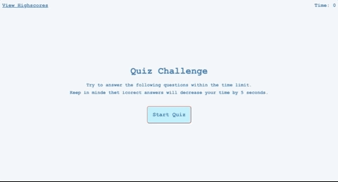

# Quiz Challenge
Quiz Challenge includes multiple-choice questions. This app will run in the browser and will feature dynamically updated HTML and CSS powered by JavaScript.

## Table of contents
* [Launch](#Launch)
* [Link-to-deployed-application](#link-to-deployed-application)
* [Technologies](#technologies)
* [Screenshot-to-deployed-application](#screenshot-to-deployed-application)
* [License](#license)
* [Contact-info](#contact-info)

## Launch
* I need my first page to be visible and the other pages shuold be hidden so to do that I used (document.querySelector("").style.display = "none";) for hidding. 
* To make the pages visible I used (document.querySelector("").style.display = "block";).
* When I click the start button a timer starts and I am presented with a questions.
* When I answer a question, I am presented with another question.
* When I answer a question incorrectly, the time is subtracted from the clock and when it reach zero will stop geting new qustions and the game is over.
* Afer the game geting over my scor will present, and I need to entr my inital and then I need to submit it to the local storag.
* At the last page my initial and score will present to me.

## Link to deployed application
[Quiz-Challenge](https://asia-codeing.github.io/quiz-application/)

## Technologies
* HTML
* CSS
* JavaScript

## Screenshot to deployed application

## License
[MIT](https://choosealicense.com/licenses/mit/)

## Contact info
* [Email](mailto:asia.alius@gmail.com)
* [LinkedIn](https://www.linkedin.com/in/asia-alnahi-1562aa183/)
* [Portfolio](https://asia-codeing.github.io/my-Portfolio/#home)